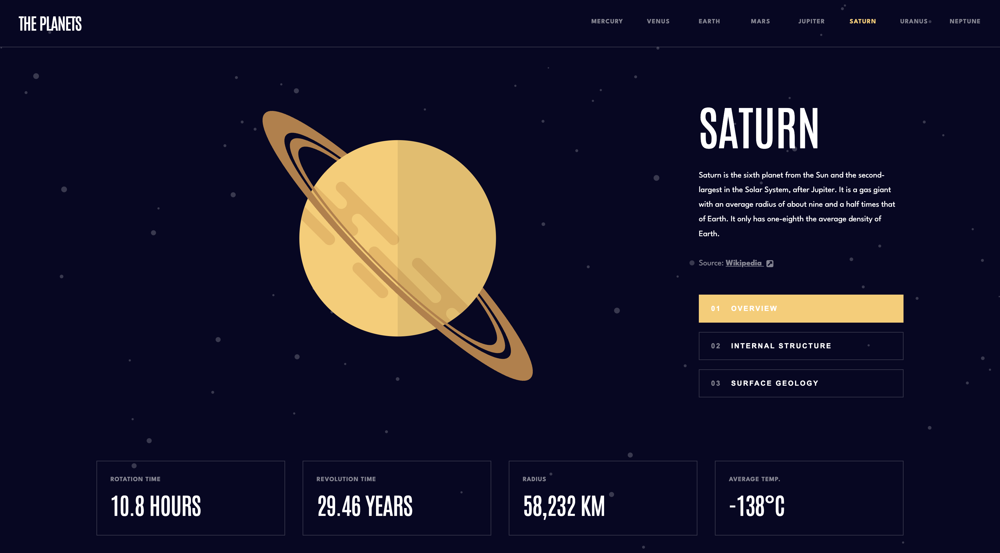
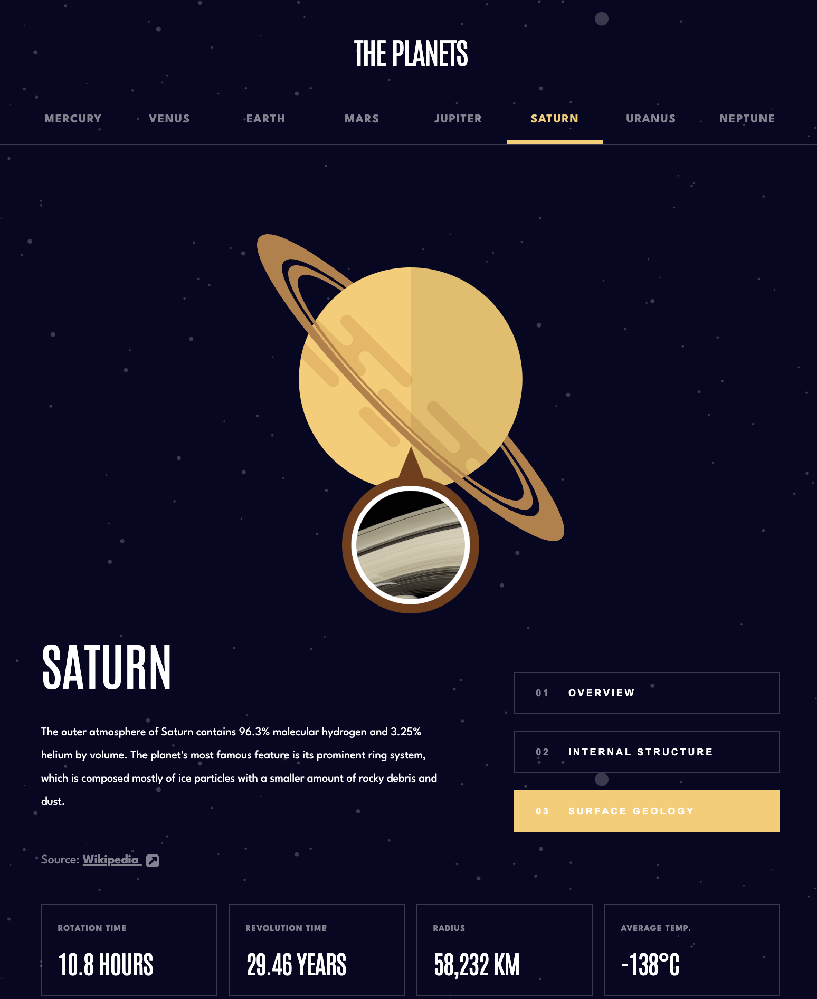
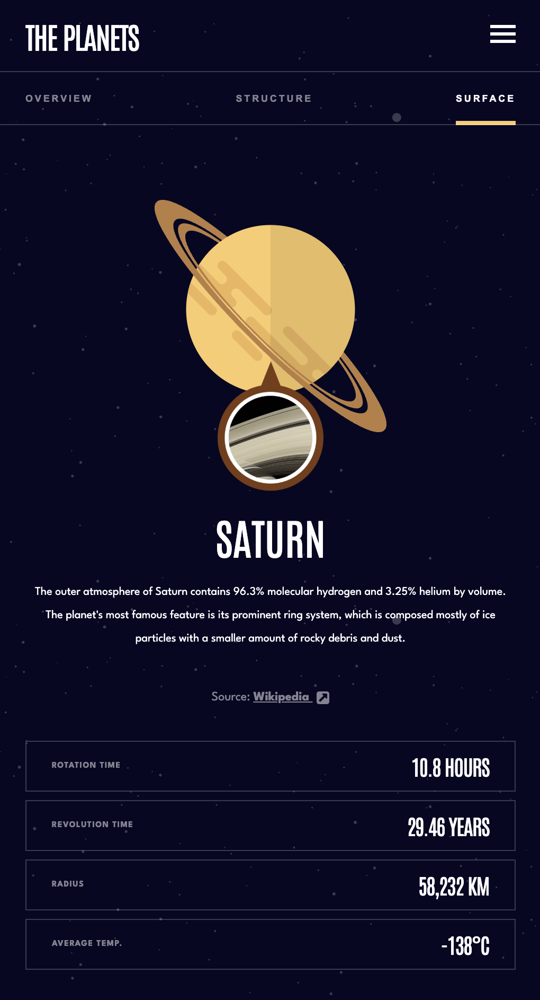

# 🪐 The Planets | Interactive Solar System Explorer

  
  
  
  

   
   

  
  
  

  

---

## 🚀 About The Project

**The Planets** is a fully responsive, interactive educational web application that brings our cosmic neighborhood directly to the browser. Designed with a meticulous mobile-first approach, it offers users a highly engaging journey through the solar system, featuring detailed overviews, internal structures, and surface geology for all eight planets.

Beyond simply displaying astronomical facts, the application is engineered to provide a cinematic and tactile user experience. It offers seamless, hardware-accelerated view transitions, dynamic interface recoloring based on the active planet's unique palette, and instant data rendering to make learning about space feel modern, weightless, and intuitive.

### 🧠 Key Technical Concepts

This project serves as a comprehensive showcase of modern front-end web development, utilizing the latest framework features and architectural best practices:

- **Modern Angular Reactivity:** Leverages Angular Signals (`computed`, `effect`, `input.required`) for granular, boilerplate-free state management and instant DOM updates.
- **State-Driven Animations:** Utilizes Angular's Animation module to orchestrate complex UI choreographies, including spring-physics pop-ups, staggered fade-ins, and smooth cross-fades tied directly to routing and state changes.
- **Dynamic CSS Theming:** Employs CSS Custom Properties (variables) bound to Angular templates to instantly globally recolor the application interface without requiring redundant CSS classes.
- **Domain-Driven Design (DDD):** Architected with a strictly organized file structure, separating `core` services, `shared` models, and modular `feature` components for enterprise-level maintainability and scalability.
- **Advanced SCSS Architecture:** Features a robust styling foundation using reusable SCSS mixins for media queries, ensuring a scalable and perfectly responsive layout from mobile devices up to 1440px desktop displays using CSS Grid and Flexbox.
- **Smart Metadata Management:** Interacts safely with the DOM via Angular's `DOCUMENT` token and `Title` service to dynamically update browser tab titles and favicons on the fly, mimicking a native application feel.

---

## 📱 Visual Showcase

> **Note:** Because this app features rich transitions, a live demo is highly recommended to experience the animations!

 
  <h3>Desktop Experience</h3>
  

 

  <h3>Responsive & Mobile Views</h3>

<table align="center" style="border: none; background-color: transparent;">
  <tr align="center">
    <td><b>Tablet View</b></td>
    <td><b>Mobile View & Nav</b></td>
  </tr>
  <tr align="center" valign="top">
    <td>
      
    </td>
    <td>
      
    </td>
  </tr>
</table>

---

## 🛠️ Built With

- **[Angular 20](https://angular.dev/)** - Framework utilizing Standalone Components, Signals, and the new Control Flow syntax (`@if`, `@for`).
- **[TypeScript](https://www.typescriptlang.org/)** - For strict typing of the Planet JSON data models and application logic.
- **[SCSS / SASS](https://sass-lang.com/)** - Utilizing mixins for localized media queries, nested syntax, and global CSS variables.
- **[Angular Animations](https://angular.dev/guide/animations)** - For complex, state-driven UI transitions and staggering effects.
- **CSS Grid & Flexbox** - Creating a robust, mobile-first layout that scales elegantly to 1440px desktop screens.
